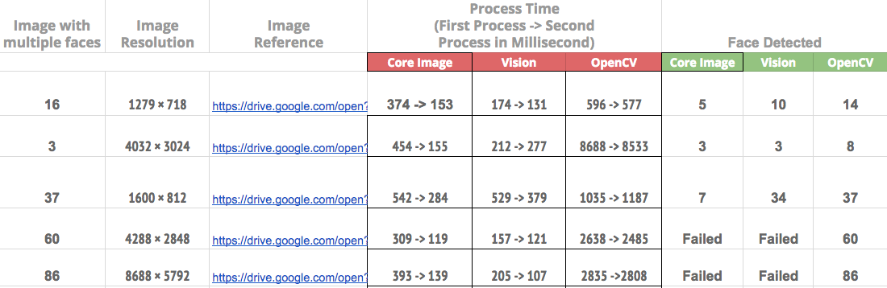
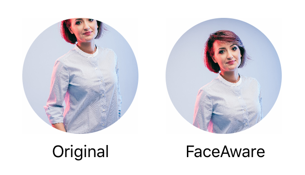
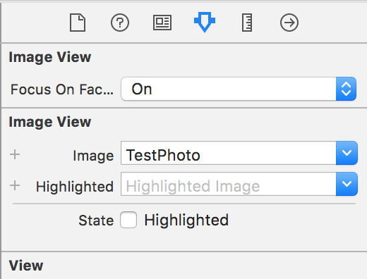

# VisionFaceAware
       
## Foreword
This package is based on https://github.com/BeauNouvelle/FaceAware which isn't maintained anymore.
Now it uses Apple's Vision Framework instead of Core Image, based on a  [comparison result](https://www.cognizantsoftvision.com/blog/face-detection-vision-core-image-opencv/)  it performs much faster and looking at the trend with ML it will be better with each new cpu iteration.  

 

## Use case
Sometimes the aspect ratios of images we need to work with don't quite fit within the confines of our UIImageViews.

 

In most cases we can use AspectFill to fit the image to the bounds of a UIImageView without stretching or leaving whitespace, however when it comes to photos of people, it's quite often to have the faces cropped out if they're not perfectly centered.

This is where VisionFaceAware comes in.
It will analyze an image either through `UIImageView`'s `image` property, or one you set using one of the built in functions and focus in on any faces it can find within.

The most common use is with avatars. 

With this library users will no longer have to crop and adjust their profile pictures.
 

## Installation
### Swift Package Manager
- In Xcode, click `File` -> `Add Packages...`  
- Insert `https://github.com/gentique/VisionFaceAware` in the search field.
- Select `Dependency Rule` "Up to Next Major Version" with "1.0.0"

## Usage 
There are a few ways to get your image views focussing in on faces within images.

### Interface Builder 
This is the easiest method and doesn't require writing any code.
The extension makes use of `@IBDesignable` and `@IBInspectable` so you can turn on focusOnFaces from within IB. However you won't actually see the extension working until you run your project.

 

### Code 
You can set `focusOnFaces` to `true`.
```swift
someImageView.focusOnFaces = true
```
Be sure to set this *after* setting your image. If no image is present when this is called, there will be no faces to focus on.

------
Alternatively you can use:
```swift
someImageView.set(image: myImage, focusOnFaces: true)
```
Which eliminates the worry of not having an image previously set.

------
You can also receive a callback for when face detection and any image adjustments have been completed by passing in a closure to the `didFocusOnFaces` property.
```swift
someImageView.didFocusOnFaces = {
     print("Did finish focussing")
}
```

### Debugging 
It  features a debug mode which draws red squares around any detected faces within an image. To enable you can set the `debug` property to true.
```swift
someImageView.debug = true
```
You can also set this flag within interface builder.

## Contributing
Pull requests are welcome. For major changes, please open an issue first to discuss what you would like to change.
